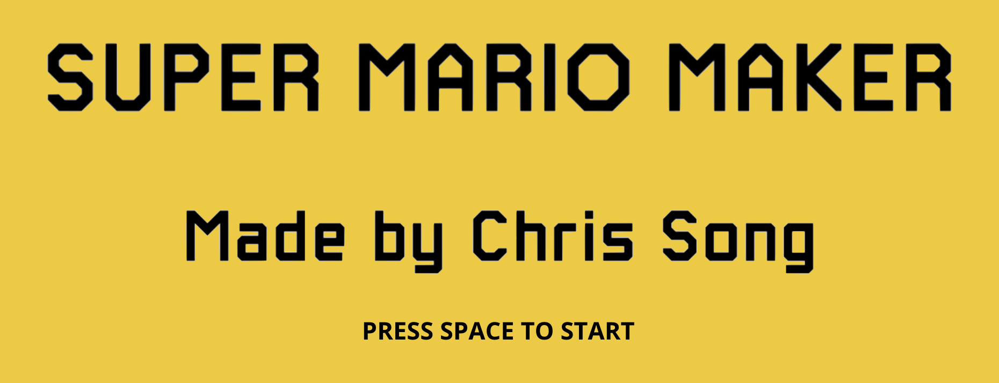
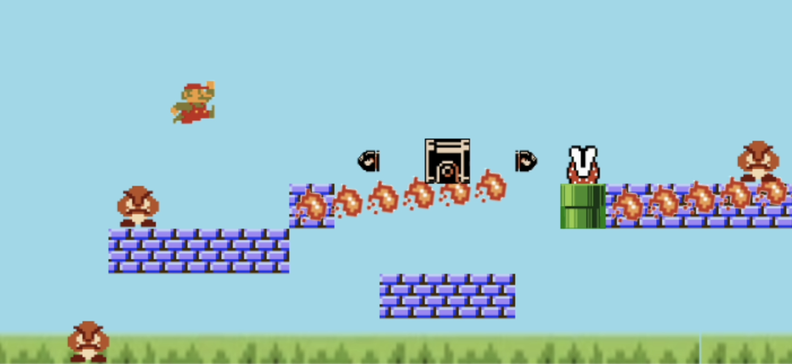

<!-- Improved compatibility of back to top link: See: https://github.com/othneildrew/Best-README-Template/pull/73 -->
<a name="readme-top"></a>
<!--
*** Thanks for checking out the Best-README-Template. If you have a suggestion
*** that would make this better, please fork the repo and create a pull request
*** or simply open an issue with the tag "enhancement".
*** Don't forget to give the project a star!
*** Thanks again! Now go create something AMAZING! :D
-->

<!-- PROJECT LOGO -->
<br />
<div align="center">
  <a href="https://github.com/csong2023/15-112_TermProject">
    
  </a>
</div>

<!-- ABOUT THE PROJECT -->
## About The Project

<br />
<div align="center">
  <a href="https://github.com/csong2023/15-112_TermProject">
    
  </a>
</div>

The goal of the project is to provide an entertaining, presentable game to the users that would be similar to Super Mario Maker, a Nintendo game. The game would consist of creator and play mode, where the user will start with the creator mode, creating the map for themselves, and then actually play inside the game as they transition to play mode. I am looking forward to a game that is smooth in terms of computational transitions and also an entertaining one with unique enemy features.

[Demo Video](https://youtu.be/BL2tXooqICw)

Main Features:
* Customization of the map 
* Playing inside the customized map
* Physics applied for movement of Mario and the rest of the enemy groups


<!-- GETTING STARTED -->
## Getting Started

Follow the below for installation/initiation of the game.

### Installation

1. [Install CMU_Graphics](https://www.cs.cmu.edu/~112/notes/install-cmu-graphics.py)
2. Enter the command below on Terminal to upgrade CMU_graphics if needed

```sh
   pip install --upgrade cmu-graphics
   ```

### Play

* Run the main.py python file in order to play.

## Acknowledgments

Thank you Ariel for guiding me through this 15-112 term project as a mentor!